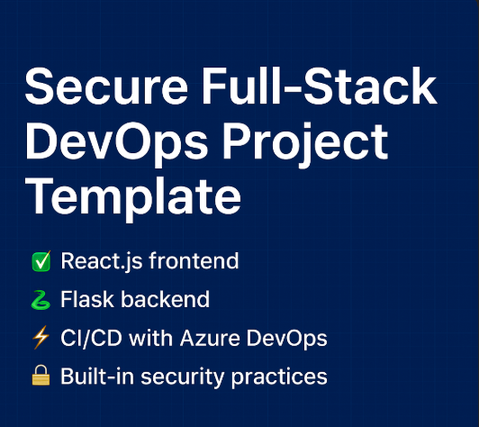

  

🔽 Download the Secure Template

Get the latest version here:  
➡️ [Enterprise Full-Stack Secure Template v1.0.0](https://github.com/QS-DP/Enterprise-Fullstack-Secure/releases/latest)

# Enterprise-Fullstack-Secure

🚀 Enterprise-Grade Full-Stack Template with Azure DevOps & CLI Automation

This repository provides a secure, production-ready full-stack application scaffold powered by:

⚛️ React.js frontend

🐍 Flask backend with Python virtual environment

🤖 Local .bat script for CI/CD simulation

🚀 Azure DevOps Pipelines, fully configured from the Azure CLI

🔐 Built-in security practices for real-world deployments

🧱 Why this project matters:

- Designed to mirror enterprise-level DevOps workflows, this repo is ideal for:

- Junior developers learning Azure DevOps & secure app delivery

- DevOps professionals building fast, repeatable pipelines

- Startup teams needing a battle-tested full-stack foundation

🔒 Built-In Security Features:

- Environment-isolated Python virtualenv (venv)

- Secure .env handling (ready to integrate)

- Minimal attack surface on Flask backend

- Azure DevOps pipeline isolation with Node & Python versions pinned

- Frontend production build isolation (no dev server exposure)

🧠 Perfect For:

- Portfolio & LinkedIn project spotlights

- Internal tooling or hackathon-ready MVPs

- Teaching DevOps/CI to junior developers

- Bootstrapping small SaaS or AI tool interfaces

Question: Want a downloadable ZIP version with everything pre-wired and secure?

📦 Get it here:

🛠️ Getting Started: 

✅ Prerequisites
Before you begin, ensure you have:

✅ Node.js v18+ and npm installed

✅ Python 3.10+ installed

✅ Git (if cloning the repo)

✅ Azure CLI installed (for DevOps pipeline setup)

✅ Windows machine (for .bat script support)

Activate Template by the follow steps below to launch the full-stack app locally and understand the secure DevOps pipeline behind it.

- - > 🔐 🔽 

📦 Step 1: Extract & Open the Project 
Download the .zip file from the GitHub Releases or link provided.

Right-click > Extract All to a known location (e.g., C:\Projects\my-enterprise-app).

Open the project folder in VS Code or your preferred editor.

🖥️ Step 2: Run the App Locally via the .bat Script
This simulates an enterprise CI/CD pipeline locally for fast prototyping.

Double-click the file named:

<pre> Run the App with spin-up.bat
- - > Double-click spin-up.bat </pre>

Watch the terminal window — confirm that it:

✅ Creates a Python virtual environment

✅ Installs backend dependencies from requirements.txt

✅ Installs frontend dependencies via npm install

✅ Builds the React app via npm run build

✅ Launches the Flask server on http://127.0.0.1:5000

✅ Pass if: You see "Running on http://127.0.0.1:5000"
(Open the URL in your browser → should load your frontend served from Flask
  spin-up.bat)

🧠 Tip: If you want to edit the script for macOS/Linux, convert it to a .sh file.

🔐 Step 3: Security Setup (Optional but Recommended)
Inside /backend, create a .env file and place sensitive configs there (e.g., API keys, secrets).

Update app.py to securely load .env values using python-dotenv:

<pre> 
python
from dotenv import load_dotenv
load_dotenv()
Add .env to .gitignore (already done for you). </pre>

🚀 Step 4: Run the Azure DevOps Pipeline
This step is for deploying to Azure using real CI/CD.

<pre>
bash
az login
az devops configure --defaults organization=https://dev.azure.com/YOUR_ORG
az pipelines create \
  --name "FullStack Pipeline" \
  --repository my-enterprise-app \
  --branch main \
  --yml-path .azure-pipelines/pipeline.yml </pre>
  
🧹 Common Issues
Issue	Solution
pip not recognized	Ensure Python and pip are in your system PATH
Flask not serving UI	Make sure frontend build folder is properly created
Azure CLI errors	Run az login and check az devops configuration

⚠️ Disclaimer:
This template includes security best practices and is designed to simulate production workflows.
While it’s deployment-ready and safe for internal tools, learning, and MVPs, you should review and customize it for use in live production environments (e.g., add auth, persistent DB, HTTPS, etc.).
